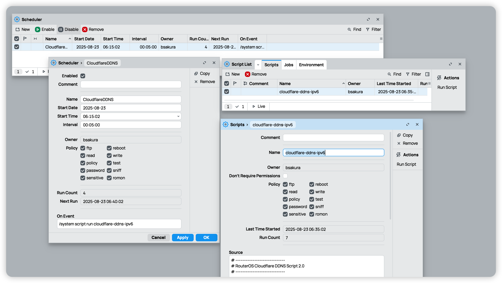

# RouterOS Cloudflare DDNS IPv6 Script

这是一个 RouterOS 脚本，用于将公网 IPv6 地址更新到 Cloudflare 的 DNS 记录，实现动态 DDNS 功能。用于 [Mikrotik](https://mikrotik.com/) RouterOS v7 路由器。
当然 RouterOS 本身也有 [Cloud](https://help.mikrotik.com/docs/spaces/ROS/pages/97779929/Cloud#Cloud-DDNS) DDN 服务，自己按需使用就好。
因为我只有移动的 Ipv6 公网地址，在使用 WireGuard 时候需要域名只有v6地址才行，Cloud 会把我非公网的v4地址添加到记录，导致 WireGuard 连接失败。 

## 特性

- 自动获取 PPPoE 接口的 IPv6（排除 link-local fe80::）  
- 更新 Cloudflare AAAA 记录  
- 仅在 IPv6 地址变化时更新  
- 支持 RouterOS 7.x  
- HTTPS 更新时忽略 CRL/证书验证（`check-certificate=no`）  

## 使用方法

1. 下载 `cloudflare-ddns-ipv6.rsc` 到本地。
2. 替换脚本中的 Cloudflare 参数：

```
CFAPITOKEN="你的 API Token"
CFZoneID="你的 Zone ID"
CFRecordID="你的 Record ID"
CFDNSNAME="你的域名"
```
* **CFAPITOKEN** - Cloudflare DNS 区域 ID。您可以在 Cloudflare 仪表板中找到它。
* **CFZoneID** - Cloudflare DNS 区域 ID。您可以在 Cloudflare 仪表板中找到它。
* **CFRecordID** - Cloudflare AuthKey/Token。您可以在 Cloudflare 仪表板中创建它。
* **CFDNSNAME** - 你需要添加解析记录的域名。 

3.  设置定时任务，每 5 分钟自动更新：
```
/system scheduler add name=CloudflareDDNS interval=5m on-event="/system script run cloudflare-ddns-ipv6"
```

## 创建 Cloudflare API Auth/Key令牌 (CFAPITOKEN)
`CFAPITOKEN`要在 Cloudflare 仪表板中创建 [Cloudflare AuthKey/Token](https://dash.cloudflare.com/profile/api-tokens)，请按照以下步骤操作：

1. 单击位于仪表板右上角的个人资料图标，然后选择“我的个人资料”。
2. 导航到“API 令牌”，然后单击“创建令牌”。
3. 选择“从模板开始”，然后选择“编辑区域 DNS”模板。
4. 在“区域资源”下，选择您的顶级域名。
5. 单击“继续摘要”继续。
6. 最后，单击“创建令牌”以生成您的 API 令牌。


## 获取 Cloudflare DNS 域区域 ID (CFZoneID)

您可以在 [Cloudflare](https://dash.cloudflare.com) 仪表板中找到它，选择左侧的“概览”域名，然后向下滚动。您会在右侧的“API 区域 ID”部分找到它。

## 使用 Linux Shell获取 Cloudflare DNS 记录 ID (CFRecordID)

```
CFAPITOKEN="你的 API Token"
CFZoneID="你的 Zone ID"
CFDNSNAME="你的域名"

curl -s -X GET "https://api.cloudflare.com/client/v4/zones/$CFZoneID/dns_records?type=AAAA&name=$CFDNSNAME" \
        -H "Authorization: Bearer $CFAPITOKEN" \
        -H "Content-Type: application/json"  | jq

## 返回结果
{
  "result": [
    {
      "id": "你的 Record ID",
      "name": "你的域名",
      "type": "AAAA",
      "content": " ",
      "proxiable": true,
      "proxied": false,
      "ttl": 1,
      "settings": {},
      "meta": {},
      "comment": null,
      "tags": [],
      "created_on": "2025-08-22T14:37:35.754383Z",
      "modified_on": "2025-08-22T14:37:35.754383Z"
    }

```

1. 此过程只需执行一次即可获取特定的记录 ID。
2. 这是针对 AAAA 型 DNS 记录的，如果您需要其他类型，请在curl命令（以及 RouterOS 脚本）中调整 URL 。
3. curl| jq命令末尾的“ ”用于以更易读的格式呈现结果。如果您没有安装jq，可以直接删除最后一个管道符并手动解析结果。

> 域名可以手动在 Cloudflare 添加一个 AAAA 记录，以便获取到 CFRecordID

## 参考项目
[bajodel/mikrotik-cloudflare-dns](https://github.com/bajodel/mikrotik-cloudflare-dns)
[Mikrotik Routeros 7.15 CF DDNS 脚本](https://tccmu.com/2024/08/06/rosddns/)